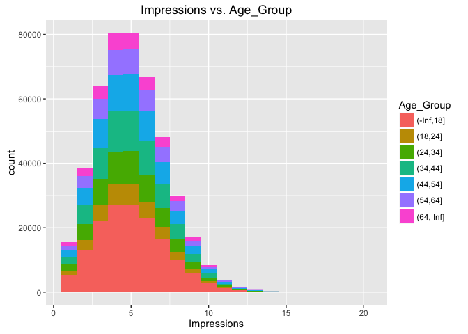
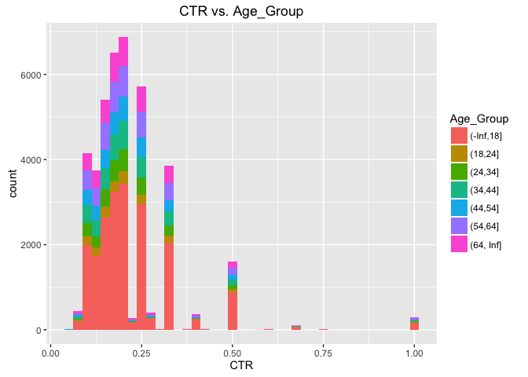
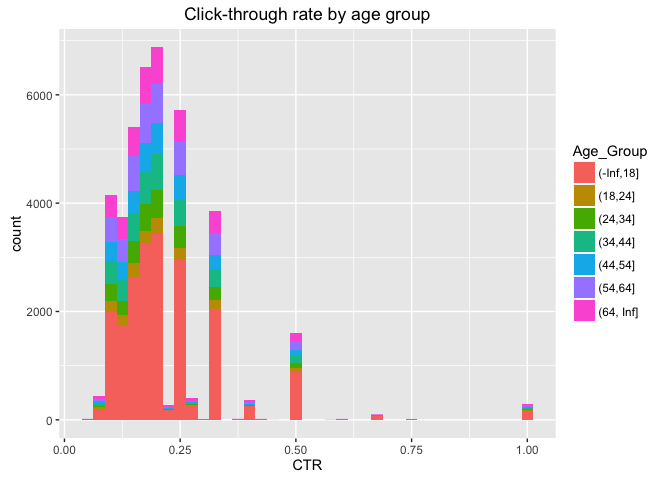
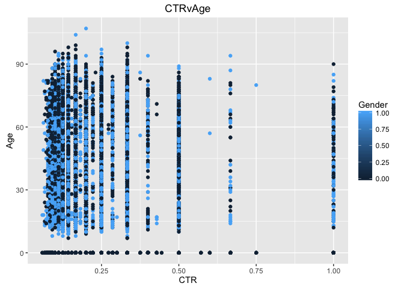

Intro
-----

In this markdown file we visualize and interpret the data file nyt1.csv

    clickfile <- "http://stat.columbia.edu/~rachel/datasets/nyt1.csv"
    clickdata <- read.csv(url(clickfile))

This portion creates a new variable called age\_group that categorizes
age into 7 different groups. Then it removes all entries that contain a
0 value for Impressions. We also create a new variable called CTR which
is click/impression

    clickdata$Age_Group <- cut(clickdata$Age, c(-Inf, 18, 24, 34, 44, 54, 64, Inf))
    ImpSub <- subset(clickdata, Impressions>0)
    ImpSub$CTR <- ImpSub$Clicks/ImpSub$Impressions 

We plot Impression vs. Age group and then we color it by the new
variable Age group using ggplot

    library(ggplot2) 
    ggplot(subset(ImpSub, Impressions>0), aes(x=Impressions, fill=Age_Group))+
      labs(title="Impressions vs. Age_Group")+
      geom_histogram(binwidth=1)

<!-- -->

We plot CTR vs. Age Group and then we color it by the new variable Age
group using ggplot

    ggplot(subset(ImpSub, CTR>0), aes(x=CTR, fill=Age_Group))+
      labs(title="CTR vs. Age_Group")+
      geom_histogram(binwidth=.025)

<!-- -->

We make a new column where the data set is sorted by the CTR value using
5 different groups

    ImpSub$sortCTR <- cut(ImpSub$CTR, c(-Inf, .2, .4, .6, .8, Inf))
    library(dplyr)

    ## 
    ## Attaching package: 'dplyr'

    ## The following objects are masked from 'package:stats':
    ## 
    ##     filter, lag

    ## The following objects are masked from 'package:base':
    ## 
    ##     intersect, setdiff, setequal, union

    library(doBy)

The first function below calls a summary of the total number of males,
that have impressions, clicked, and signed in. The function below
filters by gender, impression, clicks, and CTR, and then I just call
length of one of the columns to get the number of males.

    summaryBy(Gender+Signed_In+Impressions+Clicks~SortCTR, data = ImpSub)

    ##   Gender.mean Signed_In.mean Impressions.mean Clicks.mean
    ## 1   0.3670513      0.7009564          5.04103  0.09321768

    NewImp <- filter(ImpSub, Gender == 1 & Impressions > 0 & Clicks > 0 & Signed_In > 0 )

The length is 11303, so there are that many men that all met the
requirements. For the other quesionts we can

    length(NewImp$Gender)

    ## [1] 11303

we can get the percentage of men that signed in by multiplying the mean
by 100, so 36.7% were men.

    byAge <- group_by(ImpSub, Age_Group)
    summarise(byAge, averageImp = mean(Impressions),averageClick = mean(Clicks),averageMale = mean(Gender), averageCTR = mean(CTR))

    ## Source: local data frame [7 x 5]
    ## 
    ##   Age_Group averageImp averageClick averageMale  averageCTR
    ##      (fctr)      (dbl)        (dbl)       (dbl)       (dbl)
    ## 1 (-Inf,18]   5.033534   0.14167788   0.0790648 0.028141310
    ## 2   (18,24]   5.043240   0.04880905   0.5339864 0.009720481
    ## 3   (24,34]   5.026055   0.05081227   0.5319977 0.010146329
    ## 4   (34,44]   5.054749   0.05202148   0.5317072 0.010286330
    ## 5   (44,54]   5.045172   0.05062260   0.5292192 0.009957612
    ## 6   (54,64]   5.053484   0.10246952   0.5359633 0.020306816
    ## 7 (64, Inf]   5.046925   0.15233226   0.3632512 0.029802702

this gets all the summary statistics for each age group by calling the
group\_by function

    tableCTRvAge <- table(ImpSub$Age_Group, ImpSub$CTR)
    tableCTRvAge

    ##            
    ##                  0 0.0588235294117647 0.0625 0.0666666666666667
    ##   (-Inf,18] 135156                  4      2                 12
    ##   (18,24]    33345                  0      0                  1
    ##   (24,34]    54931                  0      0                  2
    ##   (34,44]    66802                  0      0                  1
    ##   (44,54]    60706                  0      1                  0
    ##   (54,64]    40125                  0      1                  1
    ##   (64, Inf]  24472                  0      1                  3
    ##            
    ##             0.0714285714285714 0.0769230769230769 0.0833333333333333
    ##   (-Inf,18]                 14                 61                121
    ##   (18,24]                    2                  9                  9
    ##   (24,34]                    0                  9                 23
    ##   (34,44]                    0                 11                 28
    ##   (44,54]                    3                 10                 28
    ##   (54,64]                    1                 14                 31
    ##   (64, Inf]                  5                 15                 30
    ##            
    ##             0.0909090909090909    0.1 0.111111111111111  0.125
    ##   (-Inf,18]                257    584              1147   1734
    ##   (18,24]                   30     48               128    192
    ##   (24,34]                   46     93               168    274
    ##   (34,44]                   75    121               229    381
    ##   (44,54]                   47    123               187    322
    ##   (54,64]                   75    131               252    425
    ##   (64, Inf]                 65    127               220    417
    ##            
    ##             0.133333333333333 0.142857142857143 0.153846153846154
    ##   (-Inf,18]                 2              2628                14
    ##   (18,24]                   0               251                 1
    ##   (24,34]                   0               402                 1
    ##   (34,44]                   0               498                 0
    ##   (44,54]                   0               436                 0
    ##   (54,64]                   0               631                 4
    ##   (64, Inf]                 0               545                 2
    ##            
    ##             0.166666666666667 0.181818181818182    0.2 0.214285714285714
    ##   (-Inf,18]              3203                37   3436                 3
    ##   (18,24]                 238                 2    284                 0
    ##   (24,34]                 509                 4    518                 0
    ##   (34,44]                 600                 3    675                 0
    ##   (44,54]                 501                 5    567                 0
    ##   (54,64]                 722                11    723                 0
    ##   (64, Inf]               675                10    674                 1
    ##            
    ##             0.222222222222222 0.230769230769231   0.25 0.272727272727273
    ##   (-Inf,18]               183                 0   2943                 4
    ##   (18,24]                   4                 0    221                 0
    ##   (24,34]                  10                 0    412                 0
    ##   (34,44]                   3                 0    485                 0
    ##   (44,54]                  12                 0    467                 0
    ##   (54,64]                  21                 0    609                 3
    ##   (64, Inf]                29                 1    577                 0
    ##            
    ##             0.285714285714286    0.3 0.333333333333333  0.375    0.4
    ##   (-Inf,18]               270     10              2051     13    258
    ##   (18,24]                   2      0               158      0      6
    ##   (24,34]                  12      0               251      0      4
    ##   (34,44]                  10      0               316      0      6
    ##   (44,54]                  22      0               263      0     12
    ##   (54,64]                  32      0               404      1     34
    ##   (64, Inf]                41      0               417      2     40
    ##            
    ##             0.428571428571429 0.444444444444444    0.5 0.571428571428571
    ##   (-Inf,18]                22                 2    881                 5
    ##   (18,24]                   0                 0     68                 0
    ##   (24,34]                   0                 0    106                 0
    ##   (34,44]                   0                 0    118                 0
    ##   (44,54]                   0                 0    113                 0
    ##   (54,64]                   0                 0    167                 0
    ##   (64, Inf]                 2                 0    153                 0
    ##            
    ##                0.6 0.666666666666667   0.75      1
    ##   (-Inf,18]      8                67      9    162
    ##   (18,24]        0                 2      0     13
    ##   (24,34]        0                 7      0     19
    ##   (34,44]        0                 4      0     28
    ##   (44,54]        0                 0      0     20
    ##   (54,64]        1                 7      0     36
    ##   (64, Inf]      1                 9      1     21

Here is a table of Age\_Group vs. CTR

Again i plotted CTR for age groups

    ggplot(subset(ImpSub, CTR>0), aes(x=CTR, fill=Age_Group))+
      labs(title="Click-through rate by age group")+
      geom_histogram(binwidth=.025)

<!-- -->
And here is a dot chart I made for CTR v Age colored by Gender

    ggplot(subset(ImpSub, CTR>0), )+
      labs(title="CTRvAge")+
      geom_point(aes(x=CTR, y=Age, color = Gender))

<!-- -->
